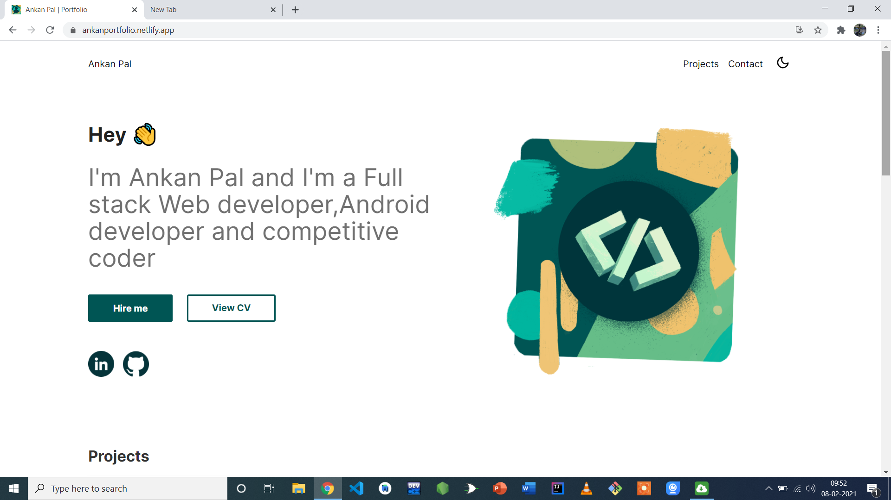
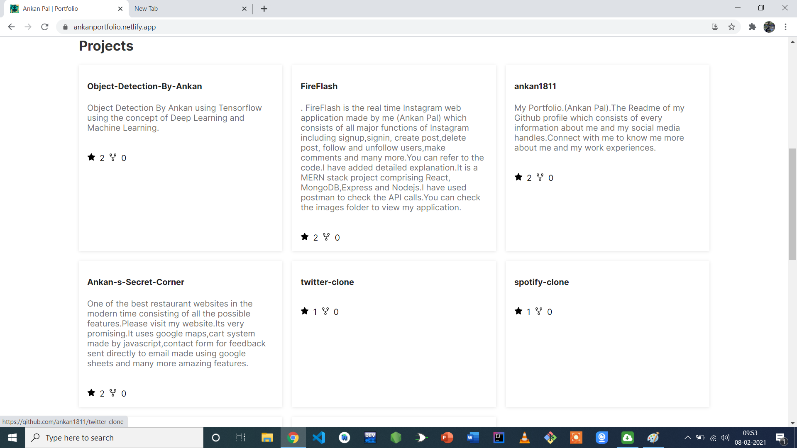
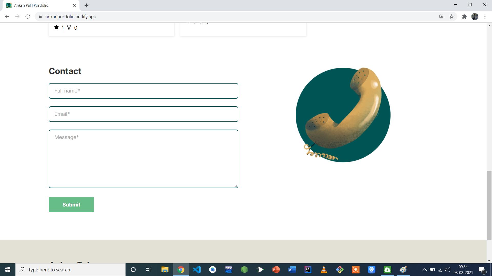
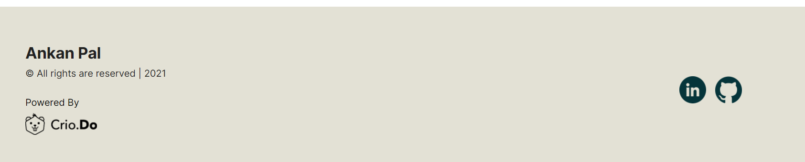

# Crio-Winter-Of-doing-Part-1

I had Completed QProfile Section In Crio Winter Of Doing 2021.
It is a full Stack Web Application built on Crio's template with front-end deployed on netifly and backend on heroku.

#  Link:  [QPROFILE CWOD](https://ankanportfolio.netlify.app/)

### 1.it consists of my Resume

### 2.Projects are accessed directly from github through github token

### 3.Contact Information sent to me

### 4.All thanks to Crio.do

